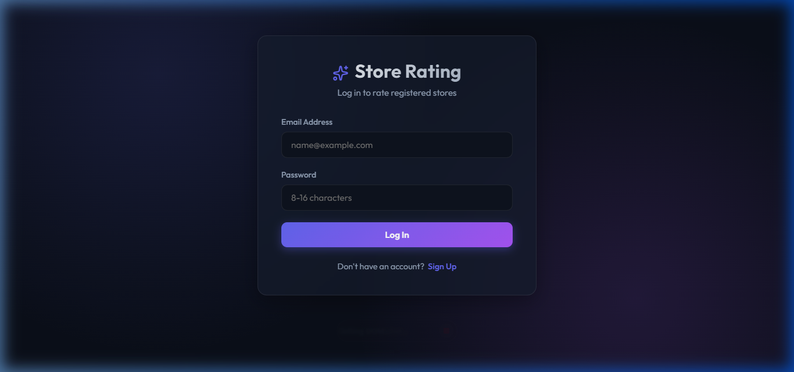
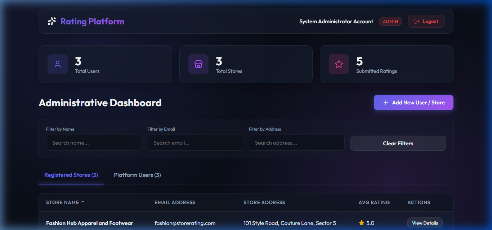
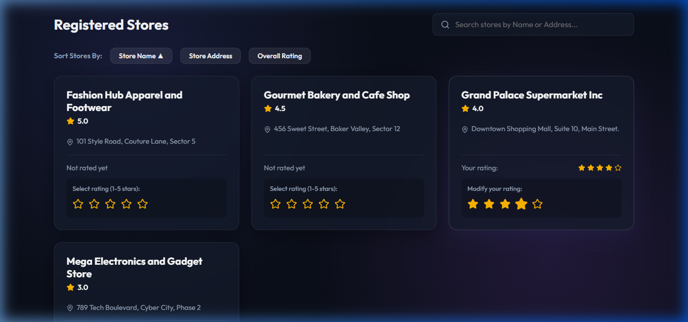
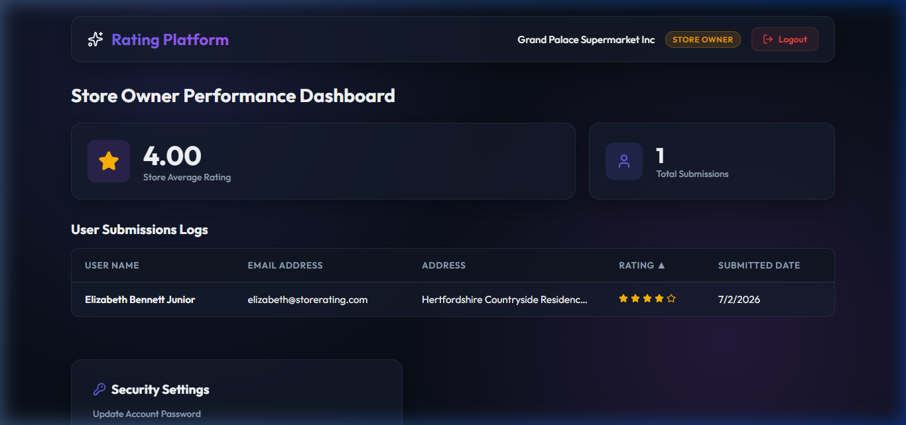

# Store Rating Platform

A FullStack Store Rating application where normal users can search registered stores and submit/modify ratings (1 to 5 stars). System administrators can manage accounts (admins, users, and stores) and inspect statistics. Store owners can track their store's overall performance.

**Live Demo:** [storerating-web.vercel.app](https://storerating-web.vercel.app/)

## Tech Stack
- **Backend:** ExpressJS, Sequelize (ORM), MySQL
- **Frontend:** ReactJS (Vite, Vanilla CSS styling)
- **Security:** JSON Web Tokens (JWT), bcrypt password hashing

---

## Form Validation Rules
All name, address, and password inputs are validated:
- **Name / Store Name:** 20 to 60 characters.
- **Address / Store Address:** Maximum 400 characters.
- **Password:** 8-16 characters, must include at least one uppercase letter and one special character.
- **Email:** Standard email format rules.

---

## Quickstart Guide

### 1. Database Configuration
Ensure MySQL is running locally on port 3306.
- The database (`store_rating_platform`) will be created automatically by the backend on startup.

### 2. Configure Environment
Create a `.env` file in the `/backend` folder. Provide your database credentials and secret keys:
```env
PORT=5000
DB_HOST=127.0.0.1
DB_PORT=3306
DB_USER=your_mysql_username
DB_PASSWORD=your_mysql_password
DB_NAME=store_rating_platform
JWT_SECRET=your_secure_jwt_secret_key
```

### 3. Run Backend (Port 5000)
```bash
cd backend
npm install
npm run dev
```
*Note: On initial start, the backend will automatically sync database models and seed mock users, stores, and ratings.*

### 4. Run Frontend (Port 5173)
```bash
cd frontend
npm install
npm run dev
```

---

## Default Seeding Accounts (For Testing)
Use the following seed email accounts to test different user roles. The default passwords follow the pattern `[Role]Pwd@123` (e.g., `AdminPwd@123` for admin, `UserPwd@123` for normal users, and `StorePwd@123` for store owners):

- **System Administrator:** `admin@storerating.com`
- **Normal User:** `user@storerating.com`
- **Store Owner:** `bakery@storerating.com`

---

## Screenshots

### 1. Login & Registration Panel


### 2. System Administrator Dashboard


### 3. Normal User Dashboard


### 4. Store Owner Dashboard


